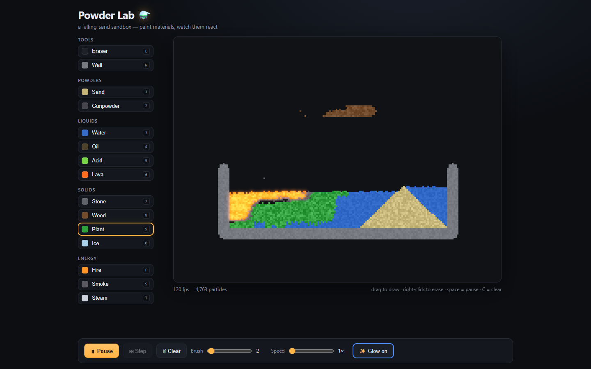
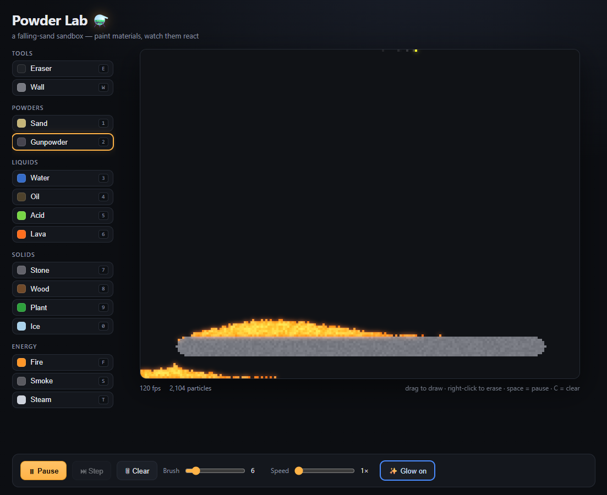

# Powder Lab ⚗️

A falling-sand sandbox in the browser — paint ~14 materials and watch them flow, burn, dissolve, and react. Built with React + TypeScript + Vite, with the entire 60fps simulation running on a plain canvas *outside* React's render cycle.

### ▶ [Play it live](https://thatmike1.github.io/powder-lab/)



## Features

- **14 materials** across powders, liquids, solids, and energy: sand, water, oil, acid, lava, stone, wood, plant, ice, fire, smoke, steam, gunpowder, walls.
- **Real reactions:**
  - 🌋 Lava + water → **stone + steam**
  - 🔥 Fire spreads through wood / oil / plants and gets **doused** by water (→ steam)
  - 🧪 Acid **dissolves** solids and powders
  - 🌱 Plants **creep** along water
  - 🧊 Ice **melts** near heat and slowly **freezes** adjacent water
  - 💥 Gunpowder **chain-detonates**
- **Density-based layering** — oil floats on water, lava sinks through everything, sand rests under water.
- **Real-time bloom/glow** on fire and lava.
- Buttery **120 fps** thanks to a dirty-chunk scheduler that only simulates regions where something is actually moving.



## Controls

| Action | Input |
| --- | --- |
| Draw | Drag on the canvas |
| Erase | Right-click drag |
| Faucet | Hold the pointer still |
| Select material | Number / letter keys (`1` sand, `3` water, `6` lava, `F` fire, …) |
| Pause / play | `Space` |
| Clear | `C` |
| Toggle glow | `G` |
| Brush size | `[` and `]` |

## Run it

```bash
npm install
npm run dev      # http://localhost:5173
```

```bash
npm run build    # typecheck + production build into dist/
npm run preview  # serve the production build
```

## How it works

The interesting architectural choice: **React owns the chrome, an imperative core owns the frame.**

```
src/
  sim/materials.ts    # material IDs + property tables (density, flammability) + UI palette
  sim/Simulation.ts   # the engine: cellular-automaton rules, reactions, chunk scheduler, renderer
  useSimulation.ts    # the rAF loop + pointer/keyboard input — the bridge between React and the sim
  App.tsx             # toolbar / canvas / controls UI
```

- **No `setState` in the hot loop.** The render loop reads a mutable `useRef` config object, so changing the brush or material never triggers a React re-render. React state is just a *mirror* for displaying the toolbar.
- **Dirty-chunk scheduling.** The grid is split into 16×16 chunks; each frame only simulates chunks flagged active, and any cell that changes wakes its neighborhood for the next frame. Settled regions cost nothing — the same trick the game *Noita* uses.
- **Data-driven materials.** Each material is an ID plus a row of properties. Complex behavior (pyramids, oil/water separation, fire fronts) emerges from a handful of local rules.

## License

MIT
