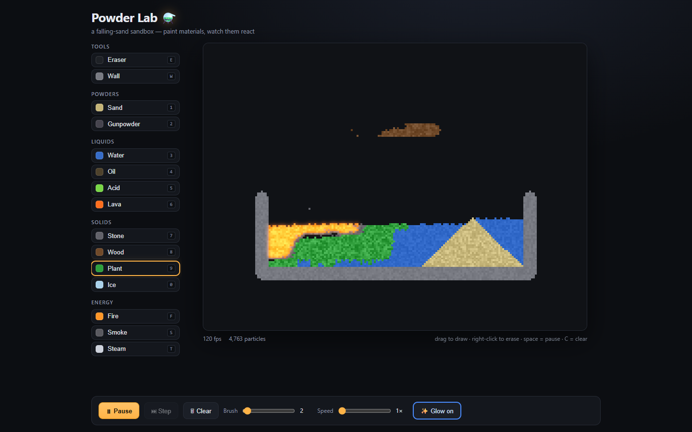
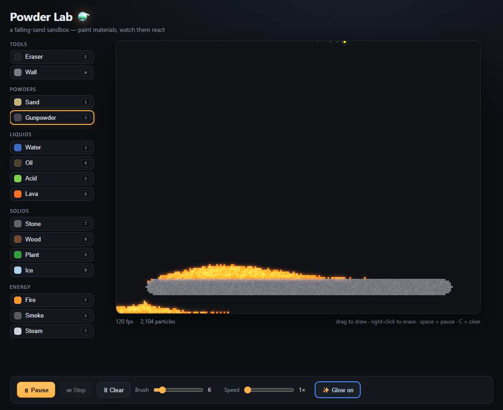

# Powder Lab ⚗️

A falling-sand sandbox in the browser — paint powders, liquids, gases and solids
and watch them flow, burn, dissolve and react. Built with React + TypeScript +
Vite, with a 75 Hz simulation running on a plain canvas outside React's render
cycle.

### ▶ [Play it live](https://powder.ssscribe.app/) — multiplayer, start a room and share the link
### ▶ [Single-player mirror](https://thatmike1.github.io/powder-lab/) (GitHub Pages, no relay)



## Features

- **Materials** include sand, water, oil, acid, lava, stone, wood, plant, ice,
  fire, smoke, steam, gunpowder, metal, filings, glass, heaters, chillers and walls.
- **Real reactions:**
  - 🌋 Lava + water → **stone + steam**
  - 🔥 Fire spreads through wood / oil / plants and gets **doused** by water (→ steam)
  - 🧪 Acid **dissolves** solids and powders
  - 🌱 Plants **creep** along water
  - 🧊 Ice warms and **melts**; cooling water **freezes** it
  - 💥 Gunpowder **chain-detonates**
- **Thermodynamics:** conducted temperature, latent heat, steam condensation,
  finite fuel, smoke and trapped-gas pressure that can rupture an enclosure.
- **Heat view, Heat/Cool brushes and thermal gallery scenes** for experimenting.
- **Density-based layering** — oil floats on water, lava sinks through everything, sand rests under water.
- **Real-time bloom/glow** on fire and lava.
- **Dirty-chunk scheduling** only processes regions with movement, thermal
  changes or gas pressure.



## Controls

| Action | Input |
| --- | --- |
| Draw | Drag on the canvas |
| Erase | Right-click drag |
| Faucet | Hold the pointer still |
| Select material | Number / letter keys (`1` sand, `3` water, `6` lava, `F` fire, …) |
| Pause / play | `Space` |
| Clear | `C` |
| Toggle glow | `G` |
| Heat view | `H` |
| Heat / Cool brush | `B` / `K` |
| Heater / Chiller | `J` / `U` |
| Brush size | `[` and `]` |

## Run it

```bash
npm install
npm run dev      # http://localhost:5173
```

```bash
npm run build    # typecheck + production build into dist/
npm run preview  # serve the production build
```

### Multiplayer

```bash
npm run server   # the relay, ws://localhost:8787
npm run dev      # in another terminal
```

Open the app, start a room from the pill in the title bar, and share the
`?room=CODE` link. The relay holds rooms in memory only; there is no database
and no account.

## Multiplayer

Rooms run **deterministic lockstep**: every client simulates the same grid and
only paint strokes cross the network, stamped with the tick at which everyone
applies them. Streaming grid deltas instead would be megabytes per second at
200x150 cells and 75 ticks per second; strokes are tens of bytes.

The price is that the simulation must be bit-identical everywhere, so all
randomness comes from one seeded generator whose state travels inside a
serialized snapshot, and every mutation — paint, magnet, lightning, clear, scene
load, pause — goes over the wire rather than being applied locally first. Room
speed is pinned to 1x for the same reason. Clients checksum their grid every 300
ticks; a mismatch pulls a fresh snapshot from the oldest peer and replays the
inputs since.

Deployed at [powder.ssscribe.app](https://powder.ssscribe.app/): the static
bundle behind Caddy, the relay as a systemd service reachable only through the
proxy at `/relay`. The GitHub Pages build has no relay, so it is single-player.

`docs/multiplayer-protocol.md` is the full specification. `server/` is a plain
`ws` relay that stamps, orders and forwards opaque blobs; it never parses a
simulation event.

Known limits in this version: no automatic rejoin after a dropped socket, and a
client joining after someone picked a gallery scene gets the room's grid but
keeps its own lighting toggles.

## How it works

The interesting architectural choice: **React owns the chrome, an imperative core owns the frame.**

```
src/
  sim/materials.ts    # material IDs + physical property tables + UI palette
  sim/thermal.ts      # fixed-point heat operations + conductivity and color lookup
  sim/state.ts        # complete, versioned little-endian multiplayer/save state
  sim/Simulation.ts   # the engine: cellular-automaton rules, reactions, chunk scheduler, renderer
  useSimulation.ts    # the rAF loop + pointer/keyboard input — the bridge between React and the sim
  App.tsx             # toolbar / canvas / controls UI
```

- **No `setState` in the hot loop.** The render loop reads a mutable `useRef` config object, so changing the brush or material never triggers a React re-render. React state is just a *mirror* for displaying the toolbar.
- **Dirty-chunk scheduling.** The grid is split into 16×16 chunks; each tick only
  simulates active chunks, and changing cells wake their neighborhood for the
  next tick. Settled regions skip the physics passes.
- **Data-driven materials.** Each material is an ID plus a row of properties. Complex behavior (pyramids, oil/water separation, fire fronts) emerges from a handful of local rules.

## License

MIT

## Thermodynamics

On `feat/thermo`, Heat view (`H`) shows temperature with a legend and a hover
readout for temperature/pressure. Paint **Heat** (`B`) to boil water, ignite fuel
or fuse sand, and **Cool** (`K`) to freeze water, condense steam or solidify lava.
Metal carries heat; stone slows it and Wall insulates. Ice warms and melts;
steam condenses instead of fading away. Wood, plants and oil have finite fuel.
Sealed steam and burning pockets build pressure and can rupture glass/wood/stone;
Wall survives. **Heater** (`J`) and **Chiller** (`U`) provide stationary hot/cold
sources. Try **Hot & Cold**, **Pressure Cooker** and **Glassworks** in the
Gallery; load a scene and press Play.

`.powder` downloads now preserve temperature, latent heat, fuel, pressure and
chunk/PRNG state. Older files still load. Shared URL links remain compact
material layouts and reset temperatures. All room peers must use the same build;
incompatible full-state versions disconnect with a reload message. See
[thermal model](docs/thermodynamics.md) for the accelerated units, thresholds and
deterministic implementation, and [PROGRESS.md](PROGRESS.md) for measured costs
and verification. `npm run bench:sim -- --stress` repeats the CPU benchmark.
